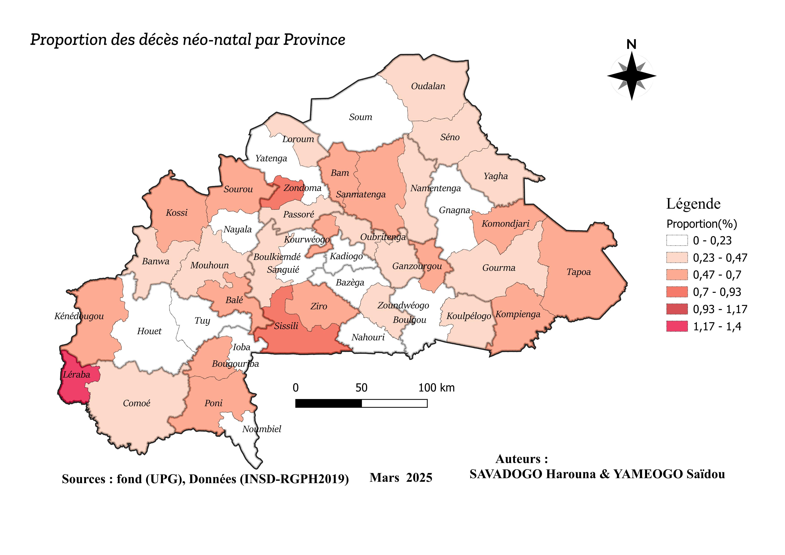
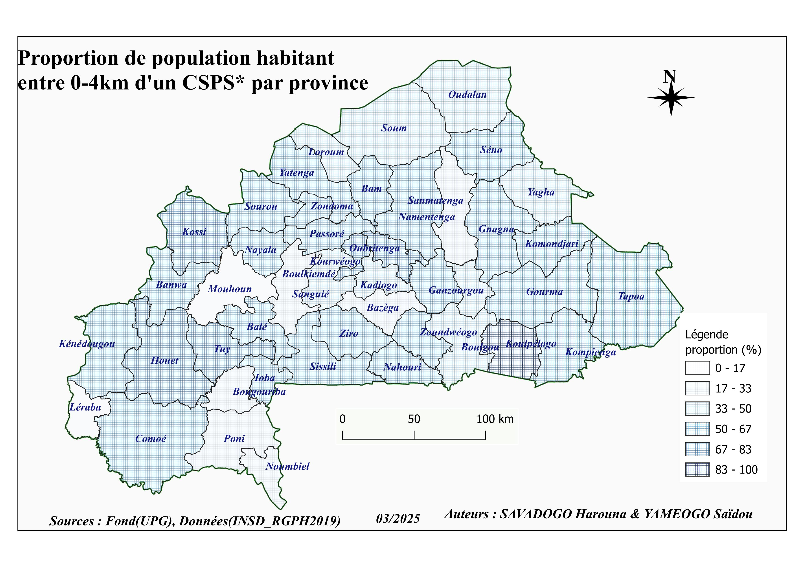
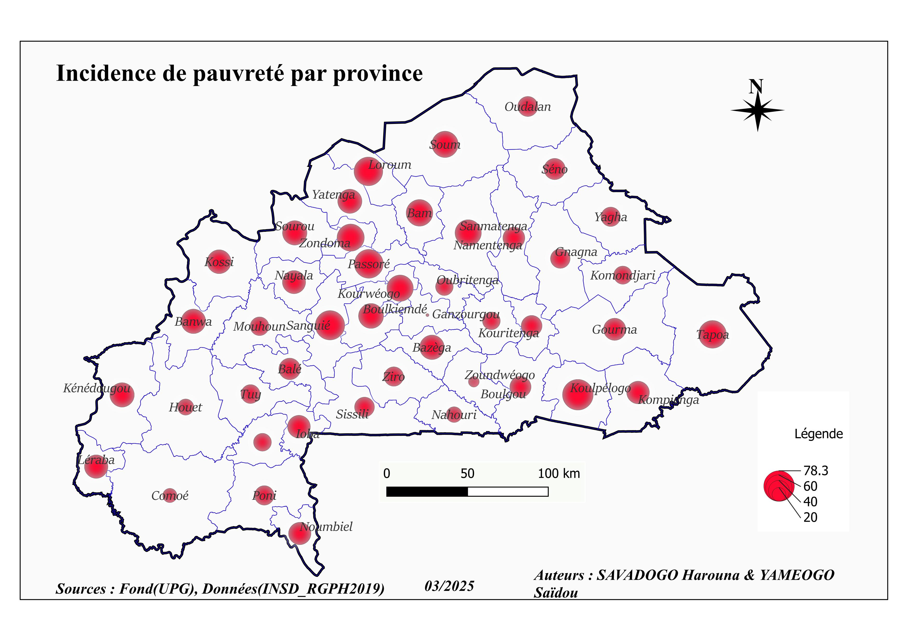
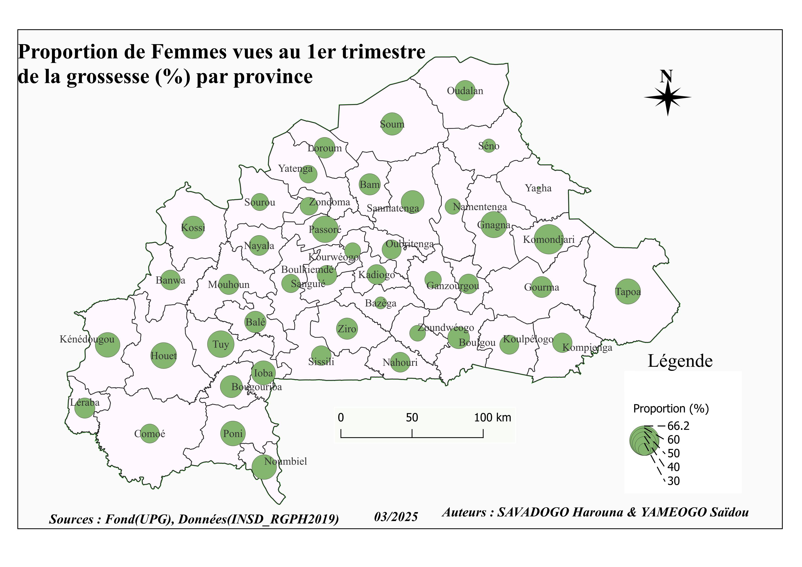
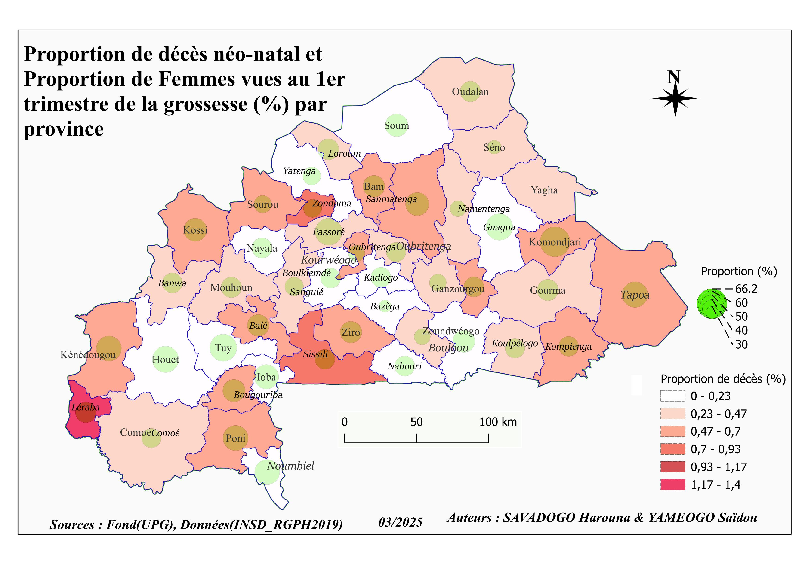
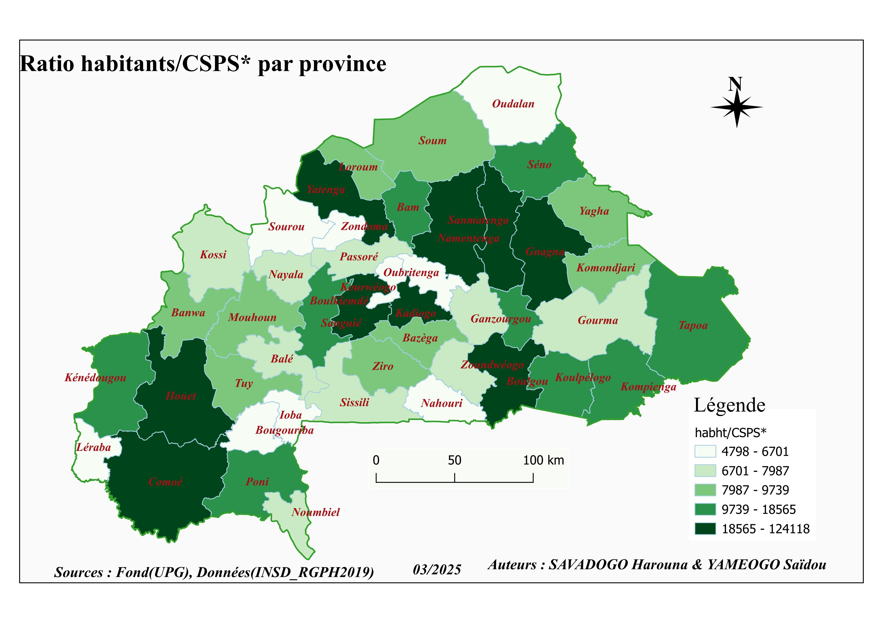
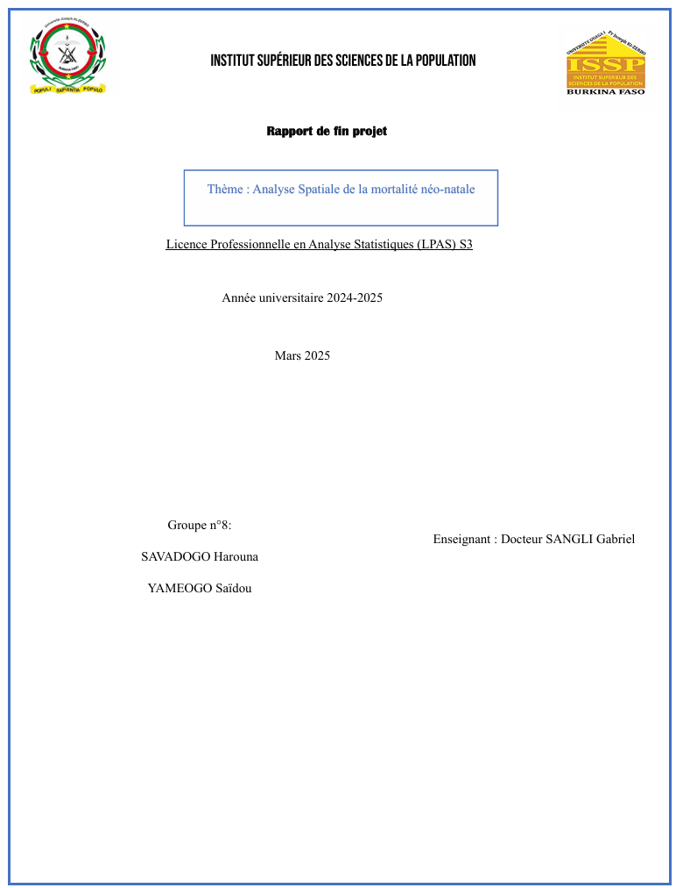

<p align="center">


</p>


<p align="center">
  <a href="#">
    
  </a>

  <a href="README_EN.md">
    
  </a>
</p>

# Résumé

*La mortalité néo-natale demeure un défi majeur de santé publique au Burkina Faso. Malgré les progrès réalisés dans le domaine de la santé maternelle et infantile, des disparités géographiques importantes persistent entre les provinces du pays.*

*Ce projet mobilise les Systèmes d'Information Géographique (SIG) afin d'analyser la distribution spatiale de la mortalité néo-natale à l'échelle provinciale. À partir de données sanitaires, démographiques et socio-économiques, plusieurs indicateurs ont été cartographiés afin d'identifier les zones les plus vulnérables et d'explorer les facteurs associés à ce phénomène.*

*L'étude combine extraction de données, traitement statistique, analyse exploratoire et cartographie thématique sous QGIS pour fournir une lecture territoriale des inégalités de santé observées au Burkina Faso.*

### 🚀 Principaux résultats

✔ Analyse réalisée sur les **45 provinces** du Burkina Faso

✔ Cartographie de la mortalité néo-natale à l'échelle provinciale

✔ Identification des provinces à risque élevé

✔ Analyse de l'accessibilité géographique aux infrastructures sanitaires

✔ Étude du lien entre pauvreté et mortalité néo-natale

✔ Production de cartes thématiques sous QGIS

✔ Utilisation conjointe de données sanitaires, démographiques et socio-économiques

**Compétences mobilisées :** SIG, géomatique, analyse spatiale, santé publique, cartographie thématique, Python, traitement de données, visualisation territoriale, aide à la décision.


# 📌 Contexte

La mortalité néo-natale correspond au décès d'un enfant durant les vingt-huit premiers jours suivant sa naissance.

Au Burkina Faso, cet indicateur demeure une préoccupation majeure pour les acteurs de la santé publique. Les disparités observées entre les provinces suggèrent l'existence de facteurs géographiques, économiques et sanitaires qui influencent différemment le risque de décès néo-natal selon les territoires.

Les Systèmes d'Information Géographique (SIG) constituent un outil particulièrement adapté pour visualiser ces disparités spatiales, identifier les zones prioritaires et soutenir les politiques publiques de santé.

> 💡 **Problématique :**
>
> Quelles sont les provinces les plus touchées par la mortalité néo-natale au Burkina Faso et dans quelle mesure les facteurs liés à l'accessibilité aux soins et à la pauvreté contribuent-ils aux disparités observées ?


# 🎯 Objectifs

### Objectif général

Analyser la répartition spatiale de la mortalité néo-natale au Burkina Faso afin d'identifier les zones prioritaires d'intervention.

### Objectifs spécifiques

- Cartographier la distribution spatiale de la mortalité néo-natale.
- Identifier les provinces à haut risque.
- Étudier l'influence de facteurs sanitaires et socio-économiques.
- Évaluer l'accessibilité géographique aux infrastructures sanitaires.
- Produire des cartes thématiques d'aide à la décision.
- Formuler des recommandations pour les décideurs publics.


# 🗂️ Données

<table>

<tr>

<td width="35%" valign="top">

<h3 align="center">Sources</h3>

| Élément | Description |
|----------|------------|
| Pays | Burkina Faso |
| Niveau géographique | Province |
| Nombre d'unités | 45 provinces |
| Source sanitaire | Annuaire statistique du Ministère de la Santé |
| Source démographique | Projections RGPH 2019 |
| Source socio-économique | Données d'incidence de pauvreté |
| Type d'analyse | Analyse spatiale |

</td>

<td width="65%" valign="top">

<h3 align="center">Variables retenues</h3>

| Variable | Description |
|-----------|------------|
| `province` | Nom de la province |
| `id_province` | Identifiant unique |
| `neo_natal_death_rate` | Proportion de décès néo-natal |
| `poverty_incidence` | Incidence de pauvreté |
| `health_access_0_4km` | Population vivant à moins de 4 km d'un centre de santé |
| `population_csps_ratio` | Ratio habitants / CSPS |
| `prenatal_visit_rate` | Femmes vues au premier trimestre de grossesse |

</td>

</tr>

</table>


# 🔬 Méthodologie

```text
Collecte des données
        │
        ▼
Extraction des tableaux PDF
        │
        ▼
Traitement sous Excel
        │
        ▼
Nettoyage et préparation
avec Python
        │
        ▼
Construction des indicateurs
        │
        ▼
Analyse statistique
• Corrélations
• Analyse descriptive
        │
        ▼
Jointure des données
avec les couches SIG
        │
        ▼
Production cartographique
sous QGIS
        │
        ▼
Analyse spatiale
et interprétation
```

### Étapes réalisées

#### 1. Collecte des données

Les données ont été extraites à partir de l'Annuaire Statistique 2023 du Ministère de la Santé ainsi que de bases socio-économiques complémentaires.

#### 2. Extraction des tableaux

Les tableaux contenus dans les fichiers PDF ont été convertis et restructurés afin d'obtenir une base exploitable.

#### 3. Préparation des données

- Nettoyage des données
- Agrégation provinciale
- Création des identifiants géographiques
- Construction des indicateurs

#### 4. Analyse statistique

Les relations entre les variables ont été explorées à l'aide des coefficients de corrélation de Pearson.

#### 5. Cartographie sous QGIS

Les données ont été intégrées dans les couches administratives afin de produire plusieurs cartes choroplèthes.


# 🛠️ Stack technique

<p align="center">


</p>


# 📊 Résultats

<table>

<tr>

<td width="50%" valign="top">

<h3>Corrélations observées</h3>

| Variable | Corrélation |
|-----------|------------|
| Pauvreté | 0.148 |
| Distance aux soins | -0.180 |
| Ratio habitants/CSPS | -0.283 |
| Consultation prénatale | 0.008 |

</td>

<td width="50%" valign="top">

<h3>Zones à risque élevé</h3>

| Province |
|-----------|
| Léraba |
| Sissili |
| Zondoma |

</td>

</tr>

</table>

## Visualisations

### Mortalité néo-natale par province




### Accessibilité aux centres de santé



### Incidence de pauvreté



### Femmes vues au premier trimestre



### Mortalité néo-natale et proportion des femmes par province



### Ratio habitants / CSPS




# 💡 Interprétation

### Zones prioritaires

La Léraba, la Sissili et le Zondoma apparaissent comme les provinces présentant les niveaux les plus élevés de mortalité néo-natale.

### Accessibilité aux soins

Les provinces où la population réside davantage à proximité des centres de santé tendent à présenter des niveaux plus faibles de mortalité néo-natale.

### Influence de la pauvreté

Une corrélation positive est observée entre l'incidence de pauvreté et la mortalité néo-natale, même si cette relation demeure faible.

### Consultations prénatales

Les données analysées montrent une relation très faible entre la consultation au premier trimestre et la mortalité néo-natale.


# 🌍 Impact

Les résultats peuvent contribuer à :

- La planification sanitaire territoriale.
- L'identification des zones prioritaires d'intervention.
- L'amélioration de l'accessibilité aux soins.
- La réduction des inégalités géographiques de santé.
- L'allocation optimale des ressources sanitaires.
- Les travaux de recherche en santé publique.
- Les études SIG appliquées au développement.


# ⚠️ Limites

> [!WARNING]
>
> Les analyses reposent sur un nombre limité d'observations (45 provinces), ce qui réduit la puissance statistique des corrélations observées.

> [!WARNING]
>
> Les données utilisées proviennent de différentes sources et peuvent comporter certaines imprécisions liées aux opérations d'extraction et d'agrégation.

> [!WARNING]
>
> Une corrélation observée ne constitue pas une relation causale.


# 🧠 Compétences développées

| Domaine | Compétences |
|----------|------------|
| SIG | QGIS, cartographie thématique |
| Analyse spatiale | Analyse territoriale |
| Data Cleaning | Extraction et préparation de données |
| Python | Traitement automatisé |
| Santé publique | Analyse d'indicateurs sanitaires |
| Statistiques | Corrélations, indicateurs |
| Géomatique | Jointures et gestion des couches |
| Visualisation | Production de cartes |
| Aide à la décision | Analyse territoriale appliquée |


# 👥 Équipe & Encadrement

## Réalisé par

<table align="center">

<tr>

<td align="center">

<b>SAVADOGO Harouna</b><br/>
<sub>Licence Professionnelle en Analyse Statistique</sub>
<br/>

<a href="https://github.com/harouna">


</a>
</td>

<td align="center">

<b>YAMEOGO Saïdou</b><br/>
<sub>Licence Professionnelle en Analyse Statistique</sub><br/>

<a href="https://github.com/yamsaid">


</a>

</td>

</tr>

</table>

## Encadrement

<table align="center">

<tr>

<td align="center">

<b>Dr SANGLI Gabriel</b><br/>
<sub>Enseignant SIG</sub><br/>
<sub>Institut Supérieur des Sciences de la Population (ISSP)</sub><br/>
<sub>Université Joseph Ki-Zerbo · Burkina Faso 🇧🇫</sub>

</td>

</tr>

</table>


# 📁 Structure du projet

```text
📦 analyse-spatiale-mortalite-neonatale/
│
├── README.md
├── Rapport.pdf
│
├── Data/
│
├── docs/
│
└── QGIS/
    ├── Cartes/
    ├── Couches/
    └── projets/
```


# 📄 Lire le rapport

<p align="center">



</p>

<p align="center">

<a href="Rapport.pdf">


</a>

</p>


# 📚 Références bibliographiques

- Laurent Boissier (2013). *La mortalité liée aux crues torrentielles dans le Sud de la France : une approche de la vulnérabilité humaine face à l'inondation.*

- Ministère de la Santé du Burkina Faso. *Annuaire Statistique 2023.*

- INSD. *Projections démographiques du RGPH 2019.*

- Investissements marginaux pour la santé maternelle et néonatale : analyse de l'accessibilité géographique aux soins obstétricaux et néonataux d'urgence.

- Plan stratégique pour le développement des systèmes d'information dans la région du Pacifique occidental.


<p align="center">

<sub>
Projet réalisé dans le cadre du cours de Système d'Information Géographique (SIG) — ISSP · Université Joseph Ki-Zerbo · Burkina Faso 🇧🇫
</sub>

</p>


